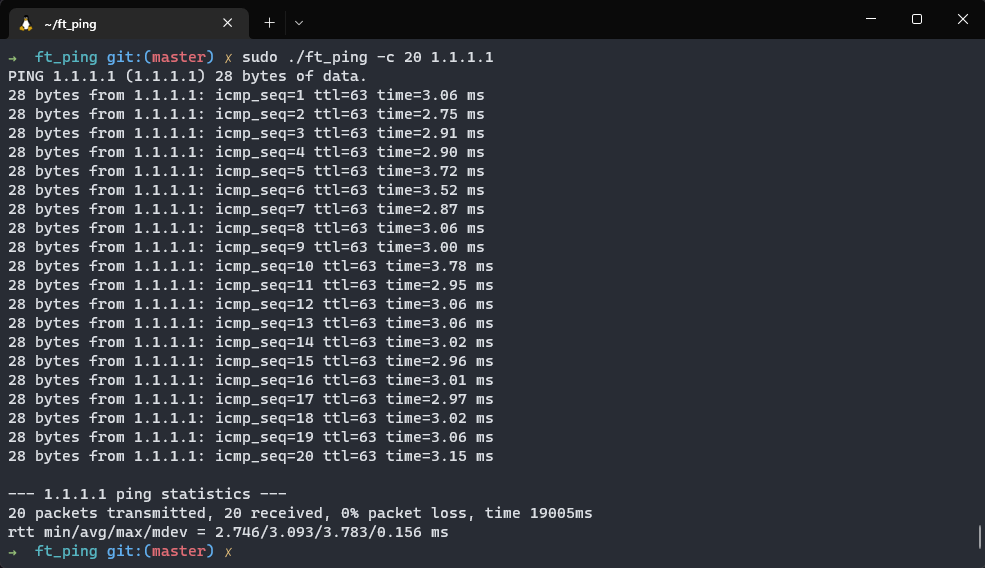
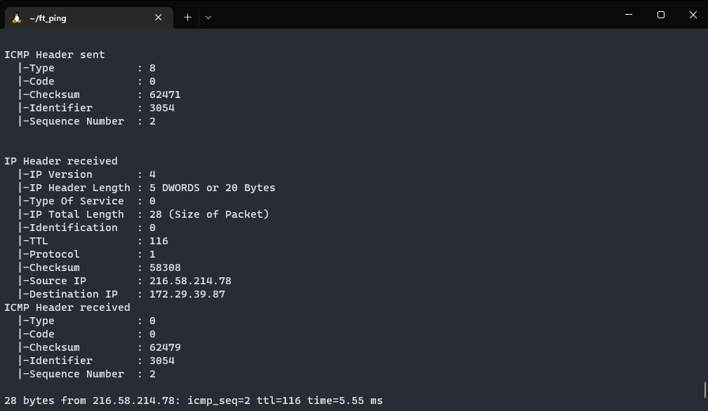
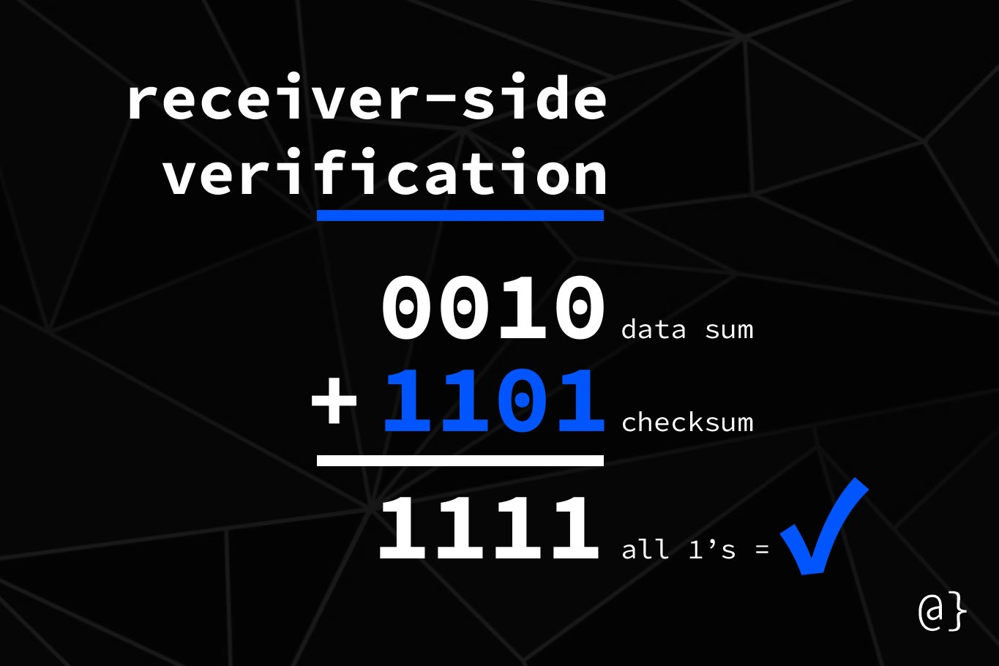

# ft_ECHO_REQUEST

Reimplementation of the command ping written in C.

ft_ECHO_REQUEST sends `ICMP_ECHO / ICMP6_ECHO_REQUEST` to network hosts. It is used to check if a host is alive. It is also used to measure the round-trip time (RTT) between a host and the source.<br>
ft_ECHO_REQUEST is fully compatible with **IPV4** and **IPV6** adresses and handles DNS resolution.

# Usage

Do `make` and then run :

```bash
sudo ./ft_ping [options] <destination>
```



> You are requiered to run the program with sudo because the program uses raw sockets (`SOCK_RAW` with the socket function).
> We are aware that options such as `SOCK_DGRAM` exits but they don't seem to work with the function specified by the subject.

Or you can also run `make run` to run the program with the specified otions in the makefile.

The following options are handled by the program:

```bash
  -a                 use audible ping
  -c <count>         stop after <count> replies
  -D                 print timestamps
  -h                 print help and exit
  -i <interval>      seconds between sending each packet
  -q                 quiet output
  -t <ttl>           define time to live
  -v                 verbose output
  -V                 debug and verbose output
  -4                 use IPv4
  -6                 use IPv6
```

If you want to see what packets we send and what packets we receive, you can use the `-V` option:



> As you may notice we do not send a `iphdr / ip6_hdr` structure since it is generated by the sendto function. Futhermore we can modify the TTL value of said structure using the `IP_TTL / IPV6_UNICAST_HOPS` socket option with the setsockopt function.


We also have a `basic` branch that you can look if you want to understand how a basic ping packet is sent and received. It supports **IPv4** and **IPv6**. However it lacks a lot of features and it only made for **educational purposes**.

# Checksum

A checksum is a data that verifies the integrity of the packet.



To calculate the checksum, we need to add the 16-bit of the packet together.
And we juste reverse bits of the result.

Just like that:
```c
unsigned short checksum(unsigned short *address, size_t len)
{
	unsigned short sum = 0;
	while (len -= sizeof(short))
		sum += *address++;
	return (~sum);
}
```

There is a example of a checksum in the [RFC](https://www.rfc-editor.org/rfc/rfc1071#section-4.1) document.

# Docs
We heavily recommend reading the following headers files:
- `<netinet/ip_icmp.h>` *(You can cast the ICMP6 header as an ICMP header).*
- `<netinet/ip.h>`
- `<netinet/ip6.h>`
<br><br>
- [RFC791](https://www.rfc-editor.org/rfc/rfc791) - Internet Protocol Specification
- [RFC792](https://www.rfc-editor.org/rfc/rfc792) - Internet Control Message Protocol (ICMP)
- [RFC1017](https://www.rfc-editor.org/rfc/rfc1071) - Computing the Internet Checksum
- [RFC3542](https://www.rfc-editor.org/rfc/rfc3542) - Advanced Sockets Application Program Interface (API) for IPv6


## MADE WITH LOVE BY :

- [execrate0](https://github.com/execrate0/) aka **ahallain**
- [Assxios](https://github.com/assxios/) aka **droge**